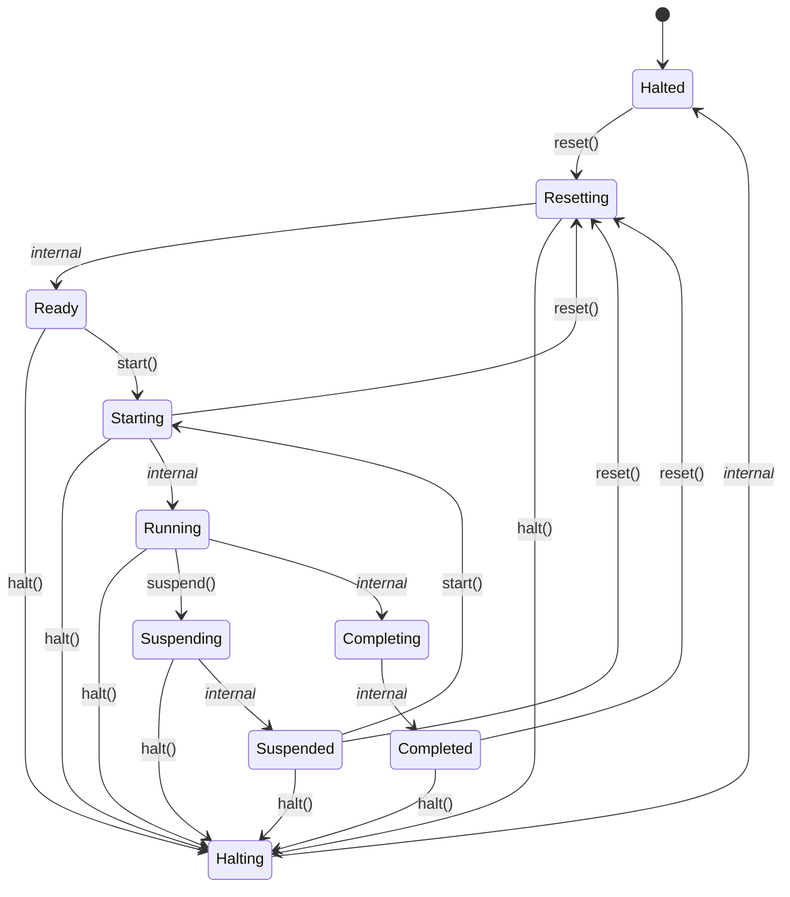
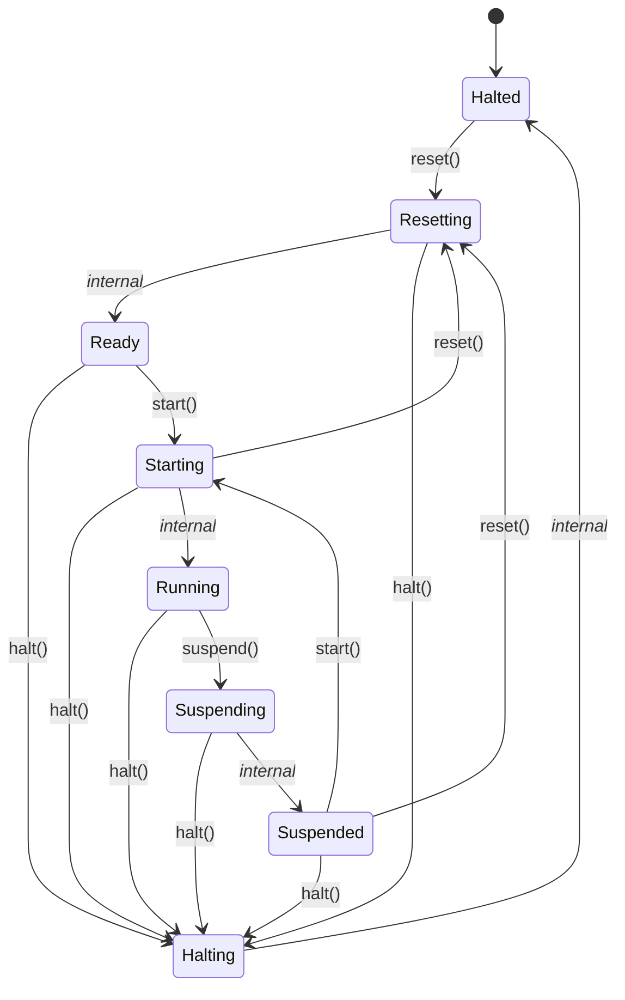

# Skills

[[_TOC_]]

## Basics

Each skill is a self-contained capability exposed over OPC-UA with `start()`/`suspend()`/`reset()`/`halt()` methods and
a standard state machine. They have

- **`ParameterSet`** — the inputs a skill needs to do its work, written by a caller before or during `start`. For
  example a "MoveTo" skill's target position, or a "Drilling" skill's hole diameter and depth.
- **`FinalResultData`** — Read-only outputs a skill produces, readable once it has done (or attempted) its work.
- **`Monitoring`** — Read-only ongoing insight into a skill *while* it is working, independent of its final result. For
  example a progress percentage, an estimated time remaining, or live sensor readings.

### Finite Skills

A finite skill is a skill that runs **once per `start()`** and ultimately reaches a terminal outcome: it either
**completes** successfully, ending in `Completed`, or fails, ending in `Halted`. Running it again — even to do the
exact same work — requires going through `reset()` back to `Ready` before `start()` can be called again; the skill
does not loop on its own.

For example, a "MoveTo" skill that moves to a specified position: `Running` drives the motion, and once the target
is reached the skill reports success and transitions through `Completing` into `Completed`, where it holds its
final position and result data until reset for the next move.

- `Halted`: A halted skill is in a failed/safe-ish state. E.g. a motor should apply fail-safe brakes, cut power etc. and
  no longer move.
- `Halting`: A halting skill is currently transitioning into `Halted`, but has not reached the safe-ish state yet. E.g.
  power to a motor was cut, but it is still rotating.
- `Resetting`: A resetting skill is preparing itself to become operational again, e.g. after being `Halted` or
  `Completed`. E.g. an axis is homing, a gripper is releasing any held part, or counters/buffers from a previous run
  are being cleared.
- `Ready`: A ready skill is idle in a safe, fully initialized state and waiting to be started. E.g. a motor is powered
  and holding position, but not yet moving; no work is in progress.
- `Starting`: A starting skill is preparing the resources needed to perform its actual work, but has not begun that
  work yet. E.g. a motor is spinning up to its target speed, or a vacuum gripper is building up suction, before the
  real operation (moving/picking) begins.
- `Running`: A running skill is actively performing its work. E.g. a motor is driving at operational speed, a
  conveyor is moving parts, or a robot arm is executing a pick-and-place motion.
- `Suspending`: A suspending skill has been asked to pause but has not yet reached a safe point to do so — it
  continues executing until it does. E.g. a robot arm keeps moving until it finishes placing the part currently in
  its gripper, rather than stopping mid-motion.
- `Suspended`: A suspended skill has paused at a safe point and is holding its state, ready to resume from exactly
  where it left off. Unlike `Halted`, this isn't a failure/safe-mode — actuators may still be powered and holding
  position. E.g. a robot arm is stationary between cycles, gripper still closed on a part, waiting to continue.
- `Completing` *(finite skills only)*: A completing skill has finished its primary work and is performing final
  cleanup or result reporting before being marked done. E.g. a gripper releases the part it just placed, or final
  measurement data is written to the result record.
- `Completed` *(finite skills only)*: A completed skill has successfully finished a single run and is holding its
  final results until it is reset for the next run. E.g. a part has been placed and the skill is reporting success
  while awaiting a `reset()` before it can `start()` again.

> [!note]
> The \*ing states (`Halting`, `Resetting`, `Starting`, `Suspending`, `Completing`) all share the same shape: they're
the "in transition, doing async work" counterparts to their target steady state, and each is driven by a _handle_* hook
that skill authors override.

### Continuous Skills

A continuous skill is a skill with no terminal "done" state — its `Running` state has no `Completed` counterpart at
all. Once started, it keeps working until it is explicitly `suspend()`ed (paused, resumable) or `halt()`ed (stopped,
non-resumable), rather than finishing on its own.

For example, a "ConveyorFeed" skill that drives a belt to keep feeding parts downstream: `Running` means the motor
is actively driving, for as long as the line needs material moved — there is no single unit of work after which the
skill would consider itself "done."

## Advanced

### Composite Skills

Composite skills are skills that orchestrate other skills to do work. A "PickAndPlace" skill might need to use multiple
calls of the "MoveTo" skill of a robot component as well as "Open" and "Close" skills of a gripper component.

A skill is called "atomic" if it does not utilize any other skill.

Composability is transitive: a composite skill can itself be a child of another composite skill, e.g. a
"PalletizeLayer" composite skill built from several "PickAndPlace" composites, in turn built from atomic "MoveTo"
and "Open"/"Close" skills.

> [!Note]
> The composite/atomic distinction is purely about what a skill's handlers do, not a different code path in the OpenSMI
framework.

### Feasibility Check

A long-term, capability-level check of whether a skill *could ever* perform a given piece of work, independent of
the machine's current situation. It answers "is this within what the skill is capable of at all?" — a property of
the skill's configuration and hardware, not of the current moment.

For example, whether a machining skill supports drilling a hole of a given diameter and depth at all, or whether a
mobile robot's configured map and drive system allow it to reach a certain location in principle.

This is decoupled from normal skill execution: it can be queried without starting the skill, and its answer is expected
to stay stable unless the skill's configuration or hardware changes (e.g. a new tool is added to its capability list, or
the map is updated).

### Precondition Check

A short-term, situational check of whether a skill *could execute feasible work right now*, given the current state
of the machine and its environment. It answers "is this actually possible at this moment?" — a property of the
present runtime situation, not of the skill's inherent capabilities.

For example, whether the drill bit required for a feasible hole is currently loaded in the tool changer, or whether the
path to an otherwise-reachable position is presently blocked by an obstacle.

This is decoupled from normal skill execution: it can be queried without starting the skill, and unlike a feasibility
check, its answer can change from one moment to the next as the environment or machine state changes.

---

*This documentation was drafted with AI assistance (Claude, Anthropic) and reviewed/edited by the author before
publication.*
